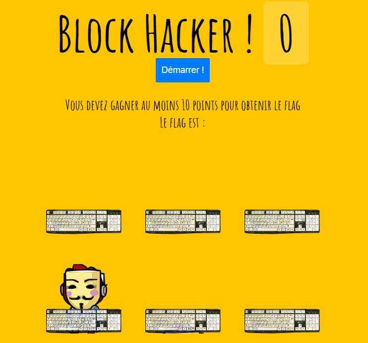

# CTF Web Client - Bouton désactivé

## Présentation du CTF 
**ID** 23 dans **les CTFs de Cyrhades**
Réussissez le FLAG de validation en effectuant un score minimum de 10 points.
Dans ce challenge l'objectif est de contourner le fait que le bouton de démarrage soit désactivé, et contourner le contrôle.

## Aperçu

-----------

## Installation manuel
Vous n'utilisez pas l'application **les CTFs de Cyrhades** ? C'est dommage !
Mais voici comment installer ce CTF manuellement :

> git clone https://github.com/Hack-Oeil/WEB_CLIENT_DISABLED_BUTTON_AND_CONTROL.git

> cd WEB_CLIENT_DISABLED_BUTTON_AND_CONTROL && docker compose up

